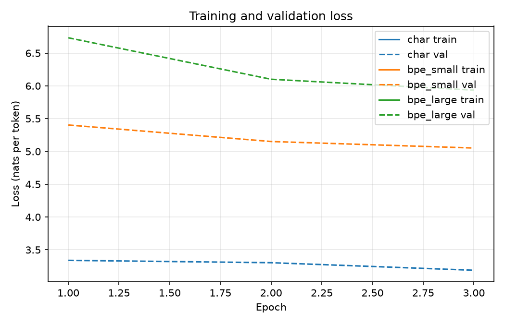

# Checkpoint

## BPE vocabulary sizes (and why)
- Small BPE tokenizer: 12000
- Large BPE tokenizer: 20000

At first I got the same tokenization behavior between my small BPE tokenizer with a vocab of 2500 and the character-based tokenizer. Felt that was odd and investigated some further. Ended up looking into how many unique characters the training data set had and concluded it was 9442. Adjusted my vocab to leave room for some merge results in addition to the "alphabet" (unique characters). This ended up giving me more expected behavior. 

## Initial tokenizer hypotheses

* I expect Mandarin Chinese to be the language to require most tokens since it is not restricted by the Latin alphabet.
* I expect the larger BPE vocabulary to capture more grammatical characteristics of each language, e. common affixes in English and Turkish and potentially more Chinese characters if it can reuse underlying bytes of each character to construct new ones.
* I expect BPE to learn common English affixes like *-hood* and *un-* and probably smaller units as well. For Turkish, I expect something similar. For Chinese, I am less sure. Perhaps the most common byte combinations for the most common characters.
* I expect BPE-based tokenizer to perhaps be better at modeling (at least for English and Turkish) since it must be useful to have access to some bigger builder blocks of language when making predictions about the next token.

## Model parameter counts

- total number of parameters: `sum(p.numel() for p in model.parameters())`
  - char model: 6 426 344
  - small bpe model: 7 735 520
  - large bpe mpodel: 11 839 520
- parameters in the input embeddings: `emsize x V`
  - char model: 256 x 9 448 = 2 148 688
  - small bpe model: 256 x 12 000 = 3 072 000
  - large bpe mpodel: 256 x 20 000 = 5 120 000
- parameters in the output vocabulary layer:  `emsize x vocab_size + vocab_size (bias)`
  - char model: 256 x 9 448 + 9 448 = 2 428 136
  - small bpe model: 256 x 12 000 + 12 000 = 3 084 000
  - large bpe mpodel: 256 x 20 000 + 20 000 = 5 140 000

## Example sentences

one English, one Turkish, and one Chinese sentence tokenized by all three tokenizers;

## Preliminary tokenizer statistics

```text
Tokenizer:  small_bpe_tokenizer
Vocab size:  12000
/srv/data/lt2326-h26/a1/valid/en.txt
Total num tokens:  134355
Avg num tokens/sent:  29.59361233480176
Avg num chars/token:  2.7410144765732576
/srv/data/lt2326-h26/a1/valid/tr.txt
Total num tokens:  138104
Avg num tokens/sent:  36.9756358768407
Avg num chars/token:  2.6674317905346694
/srv/data/lt2326-h26/a1/valid/zh.txt
Total num tokens:  312367
Avg num tokens/sent:  32.694892191752146
Avg num chars/token:  1.1789529623807893
-----------------------------------------------------------------------
Tokenizer:  large_bpe_tokenizer
Vocab size:  20000
/srv/data/lt2326-h26/a1/valid/en.txt
Total num tokens:  104461
Avg num tokens/sent:  23.009030837004406
Avg num chars/token:  3.525420970505739
/srv/data/lt2326-h26/a1/valid/tr.txt
Total num tokens:  106742
Avg num tokens/sent:  28.578848728246317
Avg num chars/token:  3.4511532480185867
/srv/data/lt2326-h26/a1/valid/zh.txt
Total num tokens:  273527
Avg num tokens/sent:  28.629579233828764
Avg num chars/token:  1.346360688341553
-----------------------------------------------------------------------
Tokenizer:  char_tokenizer
Vocab size:  9448
/srv/data/lt2326-h26/a1/valid/en.txt
Total num tokens:  368269
Avg num tokens/sent:  81.11651982378855
Avg num chars/token:  1.0
/srv/data/lt2326-h26/a1/valid/tr.txt
Total num tokens:  368383
Avg num tokens/sent:  98.62998661311914
Avg num chars/token:  1.0
/srv/data/lt2326-h26/a1/valid/zh.txt
Total num tokens:  368266
Avg num tokens/sent:  38.545740004186726
Avg num chars/token:  1.0
```

## Preliminary training/validation curve



## Interesting observeration

It was a good lesson to learn that a BPE tokenizer with too small vocabulary is essentially just a character-based tokenizer. Also interesting to see that the larger BPE tokenizer manages to create merge rules for bigram Chinese characters (e.g. "他是") to a higher degree than the smaller BPE tokenizer.

## Question for final experiments

My gut feeling is that the larger BPE model is gonna be the top performer, especially for Chinese, but it will be interesting to see if so, then by how much.
